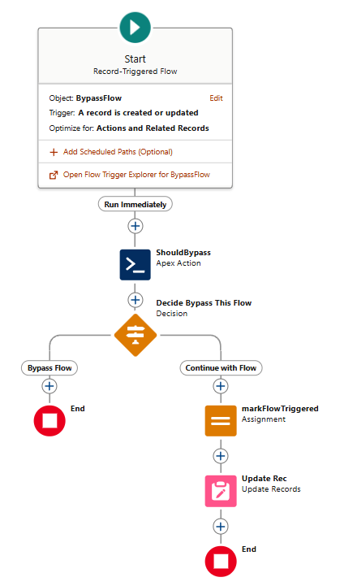

# Bypass Flow Triggers via Apex
## Why?
I've faced this way too many times, so I wondered if bypassing Flow Triggers can easily be achieved.

The idea here is to have the Flow Trigger setup mentioned below as baseline for any existing or futurely implemented Flow Triggers in your Org. 

Cons: requires Dev/engineering team to follow this strictly or implement blockers in the CI/CD pipeline/Git repo



## How to
### Flow Trigger Setup
* Add an Apex Action to your Flow Trigger
* Select Apex Action named `Bypass Flow from Apex`/`apex-FlowTriggerBypass`
* For input add a Text Constant with Flow's API name as value
* Apex Action will return a Boolean value: 
    * `true` means the Flow being executed was added to static Bypass list in Apex class `FlowTriggerBypass`; 
    * `false` means it isn't being bypassed.
* Make sure your Flow ignores the entire logic case Apex Action returns `true`
* Continue with Flow logic case Apex Action returns `false`

### Apex Usage Example:
```csharp
BypassFlow__c bf = new BypassFlow__c(TriggeredField__c = 'Will be replaced');
insert bf;

BypassFlow__c bfRequeried = [SELECT Id, TriggeredField__c FROM BypassFlow__c WHERE Id = :bf.Id];
System.debug(bfRequeried.TriggeredField__c); // shows as 'FlowTriggered', which comes from Flow Trigger


FlowTriggerBypass.addFlowToBypass('AttemptBypassFlowFromApex'); // Has to match whatever Flow sends to shouldBypass() method in FlowTriggerBypass class
bf.TriggeredField__c = 'Flow won\'t replace this value';
update bf;

bfRequeried = [SELECT Id, TriggeredField__c FROM BypassFlow__c WHERE Id = :bf.Id];
System.debug(bfRequeried.TriggeredField__c); // Should not replace value with 'FlowTriggered'

FlowTriggerBypass.clearFlowsFromBypass(); // Clears bypassed Flows from transaction
```

## Credits
If you like and wanna use it for your projects, feel free to do so. I'd be happy if you consider mentioning this github repo case you decide to use this implementation.

Thank you